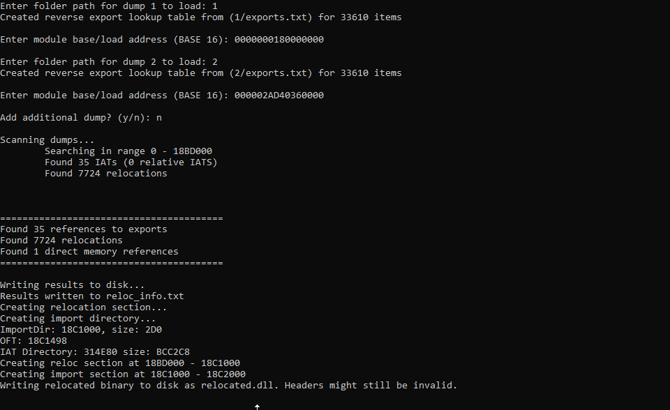

# Relocation Reconstruction
Reconstructing relocations and imports of a binary or shellcode mapped in memory can be very useful both in terms of being able to perform static analysis with a tool such like IDA Pro and have it function properly, and for breaking DRM by having the ability to load a binary for which you don't have PE headers/relocation/IAT information for.

## Limitations and requirements
This library requires a C++17 compiler (or later). 

It exclusively targets windows binaries, and the rebuilding of the .reloc section and import data is for the Windows PE format, but technically it should handle relocations for other types of executables too with some small changes.

Furthermore, it does require dumping more information than just the binary data for IAT fixing to work, since the program needs to know the addresses of imports at the time of dumping.

## Usage
When ran, the program will prompt you to input a folder path for each dump to load. You need atleast 2 dumps from different sessions so the comparison heuristic works properly.
After inputting the dumps, the relocation will start. When this is done sucessfully, it will output a `relocated.dll`, which has a fixed IAT section and .reloc section appended to it, along with a file called `reloc_info.txt`, which contains various relocation, iat, and memory reference information which can be used to properly load the relocated dll.

An example of a run can look like the following:


### Input data and format
In the same directory as the executable, have a folder for each unique dump that you are going to compare, the folder which you input must contain 2 files, a file called `mem.bin`, and a file called `exports.txt`.
`mem.bin` is the raw binary data of the executable/shellcode you want to fix.
`exports.txt` contains the addresses for all the functions exported by every dll loaded in the process at the time of dump. This looks something like the following, where the long number is the address of said function:
```
{
    "example_lib.dll": {
        "exported_fn": 140721494140440,
        "some_other_fn": 140721494140467,
        ...
    },
    "ntdll.dll": {
        "A_SHAFinal": 140721518593232,
        "A_SHAInit": 140721518593536,
        "A_SHAUpdate": 140721518593600,
        ...
    },
    ...
}
```

### Static analysis
The output dll, which has the fixed IAT's and relocation section appended to it will still have an invalid PE header, so this needs to be manually fixed before it can be loaded into a dissasembler. Fixing the headers to be compatible with a dissasembler is quite trivial with a program like CFF Explorer, where you can easily modify the header. After this is done it should be like analyzing a binary which had its relocations and IAT's intact.

### Loading a relocated binary
Please refer to the file [load_example.cpp](load_example.cpp) to see an example how the output of the reconstructor can be used to load and execute a relocated binary
